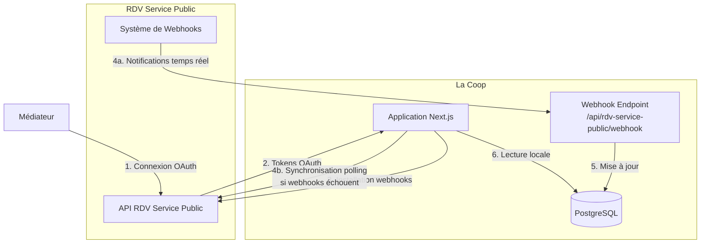

# ADR-001 : Intégration avec RDV Service Public

## Auteurs et historique

| Date | Auteur | Action |
|------|--------|--------|
| 2025-11-25 | Hugues Maignol | Rédaction initiale de l'ADR |

## Statut

Accepté

## Contexte

La Coop de la médiation numérique permet aux médiateurs de suivre leurs activités et leurs bénéficiaires. Parallèlement, [RDV Service Public](https://www.rdv-service-public.fr/) est une plateforme dédiée à la prise de rendez-vous pour les services publics, utilisée notamment par les médiateurs numériques pour gérer leurs rendez-vous avec les usagers.

Il existe un besoin fort d'intégrer ces deux systèmes afin de :

1. **Éviter la double saisie** : Les médiateurs doivent actuellement saisir leurs activités dans La coop et gérer leurs rendez-vous dans RDV Service Public séparément
2. **Synchroniser les bénéficiaires** : Un usager créé dans RDV Service Public devrait pouvoir être automatiquement accessible dans La coop
3. **Créer des CRAs depuis des RDVs** : Permettre la création d'activités (Comptes-Rendus d'Accompagnement) dans La coop à partir de rendez-vous honorés dans RDV Service Public
4. **Afficher une vue unifiée** : Présenter aux médiateurs une vue consolidée de leurs activités et rendez-vous

L'API de RDV Service Public fournit :

- Un système d'authentification OAuth 2.0
- Des endpoints REST pour accéder aux données (RDVs, usagers, organisations, etc.)
- Un système de webhooks pour notifier des changements de données
- **Mais ne fournit pas** de mécanismes de filtrage avancés, de comptage optimisé, ni de pagination unifiée avec nos activités

## Décision

Nous avons décidé de mettre en place une **architecture de synchronisation locale bidirectionnelle** des données RDV Service Public dans notre base de données PostgreSQL, plutôt qu'une intégration en temps réel reposant uniquement sur l'API distante.

### Architecture globale



### Composants de l'intégration

#### 1. Authentification OAuth 2.0

**Implémentation :** `apps/web/src/app/api/rdv-service-public/auth/callback/route.ts`

Le flux d'authentification suit le standard OAuth 2.0 :

1. L'utilisateur initie la connexion à RDV Service Public
2. Il est redirigé vers RDV Service Public pour autoriser l'application
3. RDV Service Public redirige vers notre callback avec un code d'autorisation
4. Notre application échange le code contre des tokens (access_token, refresh_token)
5. Les tokens sont stockés dans la table `rdv_accounts` avec l'id de l'agent RDV Service Public

**Modèle de données** (voir `apps/web/prisma/schema.prisma`) :

```prisma
model RdvAccount {
  id Int @id // external id of the "agent" account in rdv systems
  
  userId String @unique @map("user_id") @db.Uuid
  user   User   @relation(fields: [userId], references: [id])
  
  // OAuth credentials
  accessToken  String?   @map("access_token")
  refreshToken String?   @map("refresh_token")
  expiresAt    DateTime? @map("expires_at")
  scope        String?
  
  // Synchronization tracking
  syncFrom DateTime? @map("sync_from") // Timestamp from which we import RDVs
  lastSynced DateTime? @map("last_synced")
  error      String? // If sync operation had errors
  
  // Webhook management
  invalidWebhookOrganisationIds Int[] @default([]) @map("invalid_webhook_organisation_ids")
  
  // Relations
  organisations RdvAccountOrganisation[]
  rdvs          Rdv[]
  syncLogs      RdvSyncLog[]
  
  // Feature flags
  includeRdvsInActivitesList Boolean @default(false)
  
  created DateTime @default(now())
  updated DateTime @updatedAt
  deleted DateTime?
}
```

**Gestion du rafraîchissement des tokens** (`apps/web/src/rdv-service-public/refreshRdvAccessToken.ts`) :

Les tokens OAuth expirent après un certain temps. Avant chaque appel API, nous vérifions si le token expire dans moins d'une minute et le rafraîchissons automatiquement si nécessaire.

#### 2. Synchronisation des données via Webhooks (stratégie principale)

**Implémentation :** 
- Endpoint : `apps/web/src/app/api/rdv-service-public/webhook/route.ts`
- Handlers : `apps/web/src/features/rdvsp/webhook/`

Lors de la première synchronisation, notre application installe des webhooks sur chaque organisation RDV Service Public de l'agent :

**Installation des webhooks** (`apps/web/src/features/rdvsp/sync/installWebhooks.ts`) :

Pour chaque organisation accessible par l'agent, nous créons un webhook endpoint avec :
- `target_url` : pointant vers notre endpoint `/api/rdv-service-public/webhook`
- `subscriptions` : `["rdv", "user"]` pour être notifié des changements sur les RDVs et usagers

**Format des webhooks reçus** :

```typescript
type RdvspWebhookPayload = {
  meta: {
    model: 'rdv' | 'user' | 'absence' | 'plage_ouverture'
    event: 'created' | 'updated' | 'destroyed'
    timestamp: string
  }
  data: RdvspWebhookRdvData | RdvspWebhookUserData
}
```

**Traitement des webhooks** :

1. **Pour un RDV** (`handleRdvModelWebhook.ts`) :
   - `created` / `updated` : Synchronise le RDV, ses participations, et crée/merge les bénéficiaires correspondants
   - `destroyed` : Supprime le RDV local (cascade sur les relations)

2. **Pour un User** (`handleUserModelWebhook.ts`) :
   - `created` / `updated` : Synchronise l'usager RDV
   - `destroyed` : Supprime l'usager local

**Gestion des échecs de webhooks** :

Lors de l'installation, si un webhook ne peut pas être créé sur une organisation (erreur API, permissions insuffisantes, etc.), l'ID de cette organisation est ajouté au champ `invalidWebhookOrganisationIds` du `RdvAccount`. Ces organisations nécessiteront une synchronisation par polling.

#### 3. Synchronisation par polling (stratégie de fallback)

**Implémentation :** `apps/web/src/features/rdvsp/sync/syncAllRdvData.ts`

Pour les organisations dont l'installation de webhooks a échoué (référencées dans `invalidWebhookOrganisationIds`), un mécanisme de polling est déclenché :

**Quand est-il utilisé ?**

1. **Synchronisation initiale** : Lors de la première connexion OAuth
2. **Synchronisation manuelle** : Via le bouton "Actualiser" dans l'interface (mutation tRPC `refreshRdvData`)
3. **Au chargement du dashboard** : Si `invalidWebhookOrganisationIds` n'est pas vide, le front détecte qu'une synchronisation est nécessaire

**Processus de synchronisation complète** :

```typescript
export const syncAllRdvData = async ({
  user,
  organisationIds, // scopes the refresh to specific organisations
}: {
  user: UserWithExistingRdvAccount & UserId & UserMediateur
  organisationIds?: number[]
})
```

La fonction orchestre les étapes suivantes :

1. **Rafraîchissement des métadonnées du compte** : Organisations, permissions
2. **Import des organisations** : Si sync globale (organisations non spécifiées)
3. **Import des RDVs** : 
   - Appel à l'API `/rdvs` avec filtres (dates, organisations)
   - Pour chaque RDV : import des dépendances (users, motifs, lieux)
   - Détection des diffs (created, updated, deleted)
4. **Installation/vérification des webhooks** : Tente de réinstaller les webhooks manquants
5. **Logging** : Création d'une entrée `RdvSyncLog` pour traçabilité

**Calcul du drift** :

Le "drift" représente le nombre de différences détectées entre notre base locale et l'API RDV Service Public. Un drift élevé indique que les webhooks ne fonctionnent pas correctement et que le polling est nécessaire.

```typescript
type SyncModelResult = {
  count: number    // Total d'éléments dans l'API
  created: number  // Créés localement
  updated: number  // Mis à jour localement
  deleted: number  // Supprimés localement
  noop: number     // Déjà synchronisés
  drift: number    // created + updated + deleted
}
```

### Modèle de données synchronisées

Les données RDV Service Public synchronisées localement incluent :

#### Tables principales

**RdvOrganisation** : Organisations auxquelles l'agent a accès
```prisma
model RdvOrganisation {
  id Int @id
  name        String
  email       String?
  phoneNumber String?
  verticale   String?
  
  lieux            RdvLieu[]
  rdvs             Rdv[]
  userProfiles     RdvUserProfile[]
  webhookEndpoints RdvWebhookEndpoint[]
  accounts         RdvAccountOrganisation[]
  motifs           RdvMotif[]
  
  syncedAt DateTime @updatedAt
}
```

**Rdv** : Les rendez-vous de l'agent
```prisma
model Rdv {
  id                   Int    @id
  address              String
  cancelledAt          DateTime?
  collectif            Boolean
  context              String?
  createdAt            DateTime?
  createdBy            RdvCreatorKind?
  createdByType        RdvCreatorType?
  createdById          Int?
  durationInMin        Int
  endsAt               DateTime
  maxParticipantsCount Int?
  name                 String?
  startsAt             DateTime
  status               RdvAttendanceStatus
  usersCount           Int
  uuid                 String @unique
  urlForAgents         String
  
  rdvAccountId Int
  rdvAccount   RdvAccount @relation(fields: [rdvAccountId], references: [id])
  
  organisationId Int
  motifId        Int?
  lieuId         Int?
  
  organisation RdvOrganisation @relation(fields: [organisationId], references: [id])
  lieu         RdvLieu?        @relation(fields: [lieuId], references: [id])
  motif        RdvMotif?       @relation(fields: [motifId], references: [id])
  
  activite       Activite? // FK vers notre activité si le RDV a été converti en CRA
  participations RdvParticipation[]
  
  syncedAt DateTime @updatedAt
  rawData  Json // Raw data from the RDV API for debugging
}
```

**RdvUser** : Les usagers RDV Service Public (bénéficiaires potentiels)
```prisma
model RdvUser {
  id                   Int
  address              String?
  affiliationNumber    String?
  birthDate            DateTime?
  birthName            String?
  caisseAffiliation    String?
  createdAt            DateTime?
  email                String?
  firstName            String
  lastName             String
  phoneNumber          String?
  responsibleId        Int? // Pour les enfants/dépendants
  
  responsible RdvUser?  @relation("RdvUserResponsible", fields: [responsibleId], references: [id])
  dependents  RdvUser[] @relation("RdvUserResponsible")
  
  beneficiaires  Beneficiaire[] // FK vers nos bénéficiaires La coop
  userProfiles   RdvUserProfile[]
  participations RdvParticipation[]
  
  syncedAt DateTime @updatedAt
}
```

**RdvParticipation** : Les participations d'usagers à des RDVs
```prisma
model RdvParticipation {
  id                         Int
  sendLifecycleNotifications Boolean
  sendReminderNotification   Boolean
  status                     RdvAttendanceStatus
  createdBy                  RdvCreatorKind?
  rdvId                      Int
  userId                     Int
  
  rdv  Rdv     @relation(fields: [rdvId], references: [id], onDelete: Cascade)
  user RdvUser @relation(fields: [userId], references: [id])
  
  syncedAt DateTime @updatedAt
}
```

#### Tables de référence

- **RdvMotif** : Les motifs de rendez-vous (types d'accompagnement)
- **RdvLieu** : Les lieux où se déroulent les rendez-vous
- **RdvWebhookEndpoint** : Les webhooks installés par organisation
- **RdvSyncLog** : Historique des synchronisations (audit et debug)

#### Liaison avec nos modèles métier

**Bénéficiaires** :

Notre table `beneficiaires` possède deux champs de liaison avec RDV Service Public :

```prisma
model Beneficiaire {
  // ...
  rdvServicePublicId Int? @map("rdv_service_public_id") // DEPRECATED
  rdvUserId          Int? @map("rdv_user_id")
  
  rdvUser RdvUser? @relation(fields: [rdvUserId], references: [id], onDelete: SetNull)
}
```

Lorsqu'un RDV est synchronisé, ses participants (`RdvUser`) sont automatiquement créés ou associés à des bénéficiaires existants via la fonction `createOrMergeBeneficiairesFromRdvUsers`.

**Activités** :

Notre table `activites` peut être liée à un RDV :

```prisma
model Activite {
  // ...
  rdvServicePublicId Int? @map("rdv_service_public_id") // DEPRECATED
  rdvId              Int? @unique @map("rdv_id")
  rdv                Rdv? @relation(fields: [rdvId], references: [id])
}
```

Lorsqu'un médiateur convertit un RDV honoré en activité (CRA), le lien est établi.

## Justification des choix techniques

### Pourquoi une synchronisation locale ?

#### 1. **Intégrité référentielle et clés étrangères**

En synchronisant les données localement, nous pouvons établir des relations fortes via des clés étrangères entre :
- Les RDVs et nos activités
- Les usagers RDV et nos bénéficiaires
- Les RDVs et leurs participations, lieux, motifs

Cela garantit :
- L'intégrité des données (cascade de suppression, contraintes)
- Des requêtes SQL performantes avec JOINs
- Une cohérence transactionnelle

**Sans synchronisation locale**, nous devrions :
- Faire plusieurs appels API séquentiels pour reconstituer les relations
- Gérer manuellement la cohérence (ex: que faire si un RDV référence un usager supprimé ?)
- Risquer des incohérences en cas d'erreur réseau partielle

#### 2. **Performance des requêtes : counts et agrégations**

L'API RDV Service Public ne fournit pas d'endpoints optimisés pour :
- Compter le nombre de RDVs avec des filtres complexes
- Agréger des données (ex: nombre de RDVs par statut, par mois, etc.)

Nos interfaces nécessitent ces comptages pour :

**Dashboard médiateur** (`getDashboardRdvData.ts`) :
```typescript
const [futurRdvsCount, nextRdv, passesCount, crasTodoCount] = await Promise.all([
  prismaClient.rdv.count({
    where: {
      rdvAccountId: rdvAccount.id,
      startsAt: { gte: now },
    },
  }),
  // ... autres comptages
])
```

**Statistiques** (`getTotalCountsStats.ts`) :
- Nombre total d'activités (incluant les RDVs convertis)
- Ventilation par type, thématique, durée
- Comptages avec filtres multiples (dates, lieux, bénéficiaires)

**Sans synchronisation locale**, chaque comptage nécessiterait :
1. Un appel API pour récupérer TOUS les RDVs (pas de count endpoint)
2. Filtrage côté application
3. Comptage en mémoire

Pour un médiateur avec 200 RDVs, cela représenterait plusieurs secondes de traitement et une surcharge réseau significative.

#### 3. **Filtrage avancé et recherche**

Notre interface de liste d'activités (`searchActiviteAndRdvs.ts`) permet de filtrer simultanément :
- Activités La coop
- RDVs RDV Service Public

Avec des critères comme :
- Plage de dates
- Bénéficiaire(s)
- Lieu / Structure
- Type d'activité
- Thématiques
- Statut du RDV

Ces filtres sont appliqués via une requête SQL unifiée :

```typescript
const orderedActivitesAndRdvs = await prismaClient.$queryRaw`
  (
    SELECT act.id::text, act.date, 'activite' as kind
    FROM activites act
    WHERE ${activitesFilterFragment}
  )
  UNION ALL
  (
    SELECT rdv.id::text, rdv.starts_at as date, 'rdv' as kind  
    FROM rdvs rdv
    WHERE ${rdvFilterFragment}
  )
  ORDER BY date DESC
  LIMIT ${options.limit} OFFSET ${options.offset}
`
```

**Sans synchronisation locale**, nous devrions :
1. Récupérer toutes les activités via SQL
2. Récupérer tous les RDVs via API (potentiellement plusieurs appels paginnés)
3. Fusionner et trier en mémoire
4. Paginer en mémoire

Cette approche serait :
- Très lente (plusieurs secondes)
- Impossible à paginer côté serveur
- Consommatrice en mémoire
- Source d'incohérences (données API pouvant changer entre les appels)

#### 4. **Pagination unifiée**

L'API RDV Service Public a sa propre pagination. Fusionner une liste paginée d'activités La coop avec une liste paginée de RDVs distants est mathématiquement complexe :

**Problème :** 
- Page 1 d'activités : 25 items du 1er janvier au 15 janvier
- Page 1 de RDVs : 20 items du 5 janvier au 20 janvier
- Comment afficher "page 1" unifiée triée par date ?

Il faudrait :
1. Charger toutes les pages des deux sources jusqu'à obtenir assez d'items pour la page demandée
2. Trier l'ensemble
3. Découper en pages

Cela rend la pagination quasi-impossible en pratique sans synchronisation locale.

#### 5. **Disponibilité et résilience**

Avec une synchronisation locale :
- Les données RDV restent accessibles même si l'API RDV Service Public est indisponible
- Les requêtes de consultation sont instantanées (lecture en BDD locale)
- Les erreurs réseau n'impactent que la synchronisation, pas la consultation

**En mode API direct** :
- Chaque page chargée dépend de la disponibilité de l'API RDV
- Une lenteur de l'API RDV ralentit toute notre application
- Un timeout API = page blanche pour l'utilisateur

#### 6. **Coût et latence réseau**

Chaque appel à l'API RDV Service Public :
- Nécessite une latence réseau (50-200ms en fonction de la charge)
- Consomme des quotas API potentiels
- Nécessite le rafraîchissement du token OAuth si expiré

**Exemple concret** : Afficher la liste de 50 activités/RDVs avec filtres

| Approche | Appels API | Temps estimé |
|----------|-----------|--------------|
| **Synchronisation locale** | 0 (données déjà en local) | 50-100ms (requête SQL) |
| **API directe** | 2-5 (pagination, dépendances) | 500-1000ms |

Sur un dashboard affichant plusieurs widgets (prochains RDVs, compteurs, etc.), l'approche locale est **10-20x plus rapide**.

### Pourquoi webhooks + polling en fallback ?

#### Webhooks comme stratégie principale

**Avantages** :
- Synchronisation en temps quasi-réel (délai < 1 seconde)
- Pas de polling inutile (économie de ressources)
- Données toujours à jour sans action utilisateur

**Limites rencontrées** :
- Certaines organisations n'acceptent pas les webhooks (configuration, firewall)
- Erreurs d'installation possibles (permissions, bugs API)
- Webhooks peuvent échouer silencieusement

#### Polling en fallback

Pour les organisations où les webhooks ne peuvent être installés, nous utilisons le polling :

**Déclencheurs** :
1. **Dashboard RDV** : Si `invalidWebhookOrganisationIds.length > 0`, affiche un message "Synchronisation des rendez-vous" et déclenche une synchronisation limitée à ces organisations
2. **Synchronisation manuelle** : Bouton "Actualiser" disponible dans l'interface "Mes outils"
3. **Synchronisation périodique** : Nightly via un Cron (voir packages/cdk: WebAppStack.ts)

**Optimisation** :
Le polling n'est effectué **que sur les organisations concernées** via le paramètre `organisationIds` de `syncAllRdvData`.

```typescript
// Mutation tRPC refreshRdvData
const invalidWebhookOrganisationIds = user.rdvAccount?.invalidWebhookOrganisationIds

if (invalidWebhookOrganisationIds?.length > 0) {
  await syncAllRdvData({
    user,
    organisationIds: invalidWebhookOrganisationIds, // Seules ces orgas
  })
}
```

Cela évite de resynchroniser inutilement les organisations dont les webhooks fonctionnent correctement.

### Monitoring et observabilité

#### Logs de synchronisation

Chaque synchronisation crée une entrée `RdvSyncLog` contenant :
- Timestamp de début/fin
- Nombre d'éléments synchronisés par modèle (RDVs, users, organisations, etc.)
- Nombre de créations/mises à jour/suppressions
- **Drift** : écart entre notre base et l'API (indicateur de santé des webhooks)
- Logs détaillés de l'opération
- Erreurs éventuelles

```prisma
model RdvSyncLog {
  id               String @id @default(uuid())
  rdvAccountId     Int
  started          DateTime
  ended            DateTime?
  error            String?
  log              String?
  organisationIds  Int[] // Si sync partiel
  
  // Métrique de drift global
  drift Int @default(0)
  
  // Métriques par modèle (rdvs, organisations, users, motifs, lieux, webhooks)
  rdvsCount        Int @default(0)
  rdvsDrift        Int @default(0)
  rdvsNoop         Int @default(0)
  rdvsCreated      Int @default(0)
  rdvsUpdated      Int @default(0)
  rdvsDeleted      Int @default(0)
  
  // ... idem pour les autres modèles
}
```

**Utilisation** :
- Page d'administration RDV : affiche l'historique des syncs et leur statut
- Détection de problèmes : un drift élevé indique un problème de webhooks
- Audit : traçabilité complète des synchronisations

#### Gestion des erreurs

**Erreurs OAuth** :
- Token expiré : rafraîchissement automatique
- Token révoqué : marquage du compte en erreur, notification utilisateur
- Stockage de l'erreur dans `RdvAccount.error`

**Erreurs de synchronisation** :
- Persistées dans `RdvSyncLog.error`
- Capturées par Sentry pour investigation
- Affichées dans l'interface admin

**Erreurs de webhook** :
- Organisation ajoutée à `invalidWebhookOrganisationIds`
- Fallback automatique sur le polling
- Retry lors de la prochaine synchronisation complète

## Conséquences

### Avantages

1. **Performance** : 
   - Requêtes de lecture instantanées (BDD locale)
   - Comptages et agrégations optimisés
   - Pagination efficace

2. **Fonctionnalités avancées** :
   - Filtrage multi-critères
   - Recherche unifiée activités + RDVs
   - Statistiques complexes

3. **Expérience utilisateur** :
   - Interface réactive
   - Pas de latence réseau lors de la navigation
   - Disponibilité même si API RDV indisponible

4. **Intégrité des données** :
   - Relations fortes (FK) entre entités
   - Cohérence transactionnelle
   - Cascade de suppression

5. **Résilience** :
   - Webhooks en temps réel quand possibles
   - Polling en fallback si webhooks échouent
   - Données accessibles même en cas d'indisponibilité API

### Inconvénients et limitations

1. **Complexité** :
   - Code de synchronisation à maintenir
   - Gestion des webhooks et du fallback
   - Détection et résolution des conflits potentiels

2. **Stockage** :
   - Duplication des données RDV Service Public
   - Croissance de la base de données
   - Maintenance des indexes

3. **Latence de synchronisation** :
   - Données pas exactement en temps réel (délai webhook : ~1s, polling : minutes)
   - Possibilité de désynchronisation temporaire si webhooks défaillants

4. **Migration et évolution** :
   - Si l'API RDV change, nécessite mise à jour de notre sync
   - Risque de drift si webhook mal configuré et pas détecté

5. **Coût de développement initial** :
   - Plus complexe qu'un simple appel API
   - Nécessite tests robustes de la synchronisation

### Risques et mitigations

| Risque | Impact | Probabilité | Mitigation |
|--------|--------|-------------|-----------|
| Webhooks défaillants silencieusement | Données désynchronisées | Moyen | Calcul du drift + monitoring + fallback polling |
| API RDV Service Public change de modèle | Sync cassée | Faible | Tests d'intégration + versioning API |
| Grosse volumétrie (milliers de RDVs) | Sync initiale longue | Moyen | Sync par lots + async + progress bar |
| Conflits d'écriture (modif simultanée RDV et activité) | Incohérences | Faible | Webhooks immédiate + timestamp de sync |
| Stockage croissant | Coût BDD | Faible | Archivage des vieux RDVs + politique de rétention |

## Alternatives considérées

### Alternative 1 : Appels API directs sans synchronisation

**Principe** : Interroger l'API RDV Service Public à chaque affichage

**Avantages** :
- Simplicité de développement
- Pas de désynchronisation possible
- Pas de stockage dupliqué

**Inconvénients** :
- Latence réseau à chaque consultation
- Impossible à filtrer/paginer/compter efficacement
- Pas de vue unifiée activités + RDVs
- Dépendance totale à la disponibilité API

**Raison du rejet** : Incompatible avec nos besoins de performance et de fonctionnalité (pagination unifiée, filtres, stats).

### Alternative 2 : Cache en mémoire (Redis) temporaire

**Principe** : Utiliser Redis pour mettre en cache les données RDV pendant quelques minutes

**Avantages** :
- Plus rapide que les appels API directs
- Pas de stockage permanent

**Inconvénients** :
- Pas de relations SQL (pas de JOINs)
- Difficile de gérer les filtres complexes
- Invalidation du cache complexe
- Pas de persistance (perte du cache au redémarrage)
- Ne résout pas le problème de pagination unifiée
- Mise en place d'elements d'infrastructure supplémentaire / complexité de maintenance supplémentaire

**Raison du rejet** : Ne répond pas aux besoins d'intégrité référentielle et de requêtage avancé.

### Alternative 3 : Synchronisation locale en lecture seule (sans webhooks)

**Principe** : Synchronisation uniquement via polling périodique (ex: toutes les 10 minutes)

**Avantages** :
- Plus simple que webhooks + polling
- Mêmes avantages de performance que l'approche retenue

**Inconvénients** :
- Latence de synchronisation élevée (jusqu'à 10 minutes)
- Surcharge API (polling constant même sans changement)
- Expérience utilisateur dégradée (données pas à jour)

**Raison du rejet** : Latence inacceptable pour un outil de gestion quotidien. Les médiateurs créent des RDVs et veulent les voir immédiatement.

### Alternative 4 : Synchronisation bidirectionnelle complète

**Principe** : Permettre la création/modification de RDVs depuis La coop, synchronisés vers RDV Service Public

**Avantages** :
- Coop devient source de vérité
- Médiateurs n'ont plus besoin d'aller sur RDV Service Public

**Inconvénients** :
- Complexité très élevée (gestion des conflits)
- Risque de désynchronisation
- RDV Service Public a des règles métier complexes (disponibilités, contraintes horaires)
- Hors périmètre du besoin initial

**Raison du rejet** : Trop complexe pour les bénéfices. RDV Service Public reste la source de vérité pour les RDVs, La coop les consomme en lecture + conversion en activités.

**Note** : Nous permettons tout de même la création de "RDV plans" (pré-réservation) depuis La coop via l'API RDV, mais sans gestion complète du cycle de vie.

## Implémentation technique

### Architecture des modules

```
apps/web/src/
├── rdv-service-public/              # Couche d'intégration OAuth et API
│   ├── executeOAuthRdvApiCall.ts    # Wrapper axios avec gestion token
│   ├── refreshRdvAccessToken.ts      # Refresh automatique des tokens
│   ├── getUserContextForRdvApiCall.ts # Récupération context utilisateur
│   ├── getRdvs.ts                    # Récupération RDVs (pour affichage legacy)
│   └── ...
│
├── features/rdvsp/                   # Logique métier RDV Service Public
│   ├── sync/                         # Synchronisation
│   │   ├── syncAllRdvData.ts        # Orchestration de la sync complète
│   │   ├── importRdvs.ts             # Import des RDVs depuis API
│   │   ├── importOrganisations.ts    # Import des organisations
│   │   ├── installWebhooks.ts        # Installation des webhooks
│   │   ├── refreshRdvAgentAccountData.ts # Refresh métadonnées compte
│   │   ├── createOrMergeBeneficiaireFromRdvUsers.ts # Création/fusion bénéficiaires
│   │   └── syncLog.ts                # Utilitaires de logging
│   │
│   ├── webhook/                      # Traitement des webhooks
│   │   ├── handleRdvModelWebhook.ts  # Handler webhook RDV
│   │   ├── handleUserModelWebhook.ts # Handler webhook User
│   │   └── rdvWebhook.ts             # Types et validation
│   │
│   ├── queries/                      # Requêtes BDD optimisées
│   │   └── getDashboardRdvData.ts    # Données dashboard
│   │
│   └── administration/               # Outils admin
│       ├── getAdministrationRdvspData.ts
│       └── getAdministrationRdvspUserData.ts
│
├── server/rpc/rdv-service-public/
│   └── rdvServicePublicRouter.ts     # Routes tRPC (mutations/queries)
│
└── app/api/rdv-service-public/
    ├── auth/callback/route.ts        # OAuth callback
    └── webhook/route.ts               # Webhook endpoint
```

### Points d'entrée API

#### Endpoints Next.js

1. **OAuth Callback** : `GET /api/rdv-service-public/auth/callback`
   - Traite le retour OAuth
   - Stocke les tokens
   - Déclenche la synchronisation initiale

2. **Webhook** : `POST /api/rdv-service-public/webhook`
   - Reçoit les notifications RDV Service Public
   - Valide et route vers les handlers appropriés

#### Routes tRPC (`rdvServicePublicRouter`)

Accessibles via `trpc.rdvServicePublic.*` :

**Queries** :
- Aucune (toutes les lectures se font directement en BDD via Prisma)

**Mutations** :

1. `oAuthApiMe` : Récupère les infos du compte agent RDV
2. `oAuthApiGetOrganisations` : Liste des organisations de l'agent
3. `refreshRdvAccountData` : Rafraîchit les métadonnées du compte
4. `deleteRdvAccount` : Déconnecte le compte RDV (soft delete)
5. `updateIncludeRdvsInActivitesList` : Active/désactive l'affichage des RDVs dans la liste d'activités
6. **`syncRdvAccountData`** : Déclenche une synchronisation complète (première connexion)
7. **`refreshDashboardRdvData`** : Synchronisation polling pour le dashboard (si webhooks défaillants)
8. **`refreshRdvData`** : Synchronisation polling générique (si webhooks défaillants)
9. `oAuthApiCreateRdvPlan` : Crée un RDV plan dans RDV Service Public pour un bénéficiaire
10. `createActiviteFromRdv` : Convertit un RDV honoré en activité (CRA)

### Requêtes SQL optimisées

#### Comptage de RDVs avec filtres

```typescript
// apps/web/src/features/rdvsp/queries/getDashboardRdvData.ts
const futurRdvsCount = await prismaClient.rdv.count({
  where: {
    rdvAccountId: rdvAccount.id,
    startsAt: { gte: now },
  },
})
```

#### Pagination unifiée activités + RDVs

```typescript
// apps/web/src/features/activites/use-cases/list/db/searchActiviteAndRdvs.ts
const results = await prismaClient.$queryRaw`
  (
    SELECT 
      act.id::text as id,
      act.date,
      'activite' as kind
    FROM activites act
    WHERE ${activitesFilterFragment}
  )
  UNION ALL
  (
    SELECT 
      rdv.id::text as id,
      rdv.starts_at as date,
      'rdv' as kind
    FROM rdvs rdv
    LEFT JOIN activites act ON act.rdv_id = rdv.id
    WHERE ${rdvWhereClause} AND ${rdvFilterFragment}
  )
  ORDER BY date DESC
  LIMIT ${limit} OFFSET ${offset}
`
```

#### Comptage global avec filtres

```typescript
const [activitesCount, rdvsCount] = await Promise.all([
  prismaClient.$queryRaw<{ count: number }[]>`
    SELECT COUNT(id)::INT as count
    FROM activites act
    WHERE ${activitesFilterFragment}
  `,
  prismaClient.$queryRaw<{ count: number }[]>`
    SELECT COUNT(rdv.id)::INT as count
    FROM rdvs rdv
    LEFT JOIN activites act ON act.rdv_id = rdv.id
    WHERE ${rdvWhereClause} AND ${rdvFilterFragment}
  `,
])
```

Ces requêtes sont **impossibles à réaliser efficacement** sans synchronisation locale.

## Tests et validation

### Tests d'intégration qui restent à implémenter

Les tests d'intégration devraient vérifier :
1. Le flux OAuth complet (mock de l'API RDV)
2. La synchronisation initiale
3. Le traitement des webhooks
4. Le fallback polling
5. La conversion RDV -> Activité

### Tests end-to-end (Cypress)

Les tests E2E devraient vérifier les parcours utilisateurs :
1. Connexion d'un compte RDV Service Public
2. Affichage du dashboard avec RDVs
3. Filtrage de la liste d'activités incluant RDVs
4. Création d'un CRA depuis un RDV
5. Déconnexion du compte RDV

### Monitoring en production

- **Sentry** : Capture des erreurs de synchronisation
- **Logs Cockpit (Scaleway)** : Logs détaillés des webhooks et syncs
- **Page d'administration** : Visualisation des RdvSyncLogs par l'équipe de développement / produit / administrateurs / support

## Références

- [RDV Service Public - Documentation API](https://www.rdv-service-public.fr/api-docs/index.html)
- [OAuth 2.0 RFC](https://datatracker.ietf.org/doc/html/rfc6749)
- [schema.prisma](../apps/web/prisma/schema.prisma) : Schéma de données complet
- [rdvServicePublicRouter.ts](../apps/web/src/server/rpc/rdv-service-public/rdvServicePublicRouter.ts) : Routes tRPC
- [syncAllRdvData.ts](../apps/web/src/features/rdvsp/sync/syncAllRdvData.ts) : Logique de synchronisation

---

**Note** : Cet ADR documente une décision d'architecture déjà implémentée. Il a été rédigé a posteriori pour formaliser les choix techniques et faciliter l'onboarding de nouveaux développeurs.


